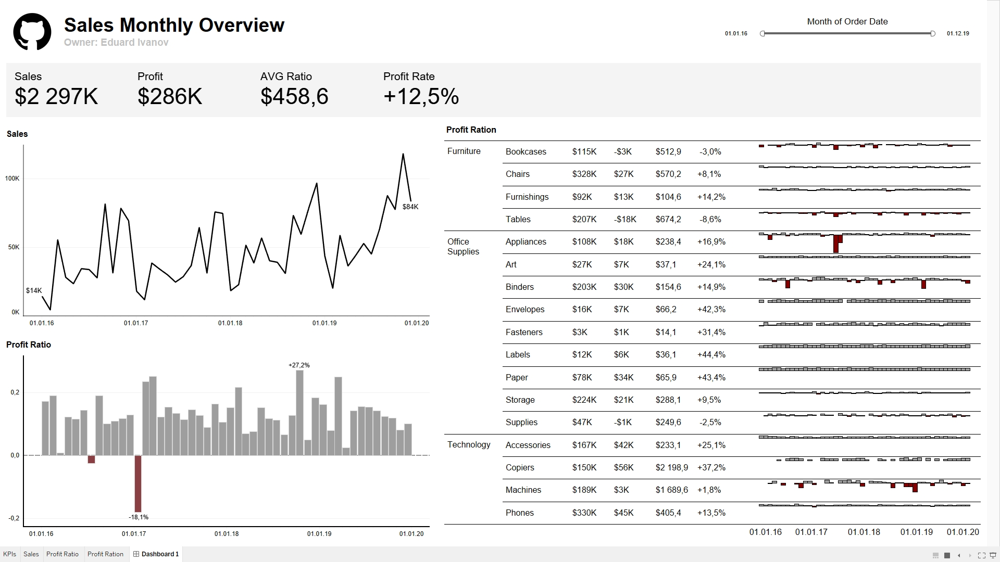

# 📊 Дашборд: Анализ продаж (Sales Monthly Overview)

## 🔍 Описание

Я разработал интерактивный дашборд в Tableau для анализа продаж, прибыли и эффективности по категориям.

Цель - наглядно отобразить ключевые метрики и выявить проблемные зоны и точки роста.

---

## 📈 Возможности

- Построил ключевые KPI: выручка, прибыль, средний чек, рентабельность
- Реализовал динамику продаж по времени
- Настроил расчет Profit Ratio
- Сделал детализацию по категориям и подкатегориям
- Добавил Мини-графики (sparklines) для отслеживания трендов внутри категорий
- Добавил фильтр по дате для интерактивного анализа

---

## 📈 Что показывает дашборд

- Общую картину бизнеса (Sales, Profit, Profit Rate)
- Динамику изменений во времени
- Прибыльность отдельных категорий
- Проблемные подкатегории с отрицательной прибылью
- Сравнение эффективности разных сегментов

---

## 🛠 Используемые инструменты

- Tableau

---

## 📸 Превью

---

## 📂 Данные

Использован датасет (Superstore)

---

## 🚀 Как открыть

 1. Скачать файл .twbx
 2. Открыть в Tableau Desktop
 3. Использовать фильтры для анализа

---

## 💡 Основные выводы

- Категория Technology показывает наибольший рост
- Есть подкатегории с отрицательной прибылью
- Видна сезонность в продажах

---
